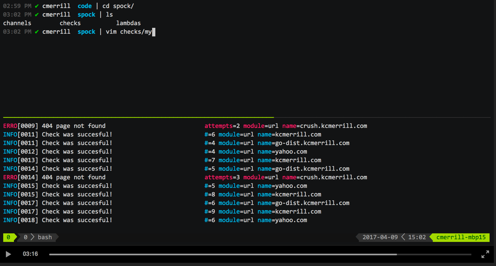

# Spock

Making sure your applications live long and prosper.

[](https://travis-ci.org/kcmerrill/spock) [](https://gitter.im/kcmerrill/spock?utm_source=badge&utm_medium=badge&utm_campaign=pr-badge&utm_content=badge)


## Binaries || Installation

[](http://go-dist.kcmerrill.com/kcmerrill/spock/mac/amd64) [](http://go-dist.kcmerrill.com/kcmerrill/spock/linux/amd64)

via go:

`$ go get -u github.com/kcmerrill/spock`

via docker:

`$ docker run -ti -v $PWD/dir/to/root/channels/and/checks:/spock kcmerrill/spock`

## 4 minute(6 http checks) setup

[](https://asciinema.org/a/112261)

## About

Not meant to be a nagios replacement per se, but if you're just a small shop with a few hundred checks, then `spock` is for you. I wanted a way to get simple and complex checks up and running without all the overhead that the bigger monitoring systems require. The simple ones, like `dead mans snitch` or `pingdom` are all great services, but they only have paid accounts and I didn't want to pay for something. Essentially `spock` is scratching an itch I've had for forever.

## The idea

The concept behind `spock` makes it dead simple to get up and running. There are two aspects you should familiarize yourself with before continuing on. `checks` and `channels`. Essentially they are yaml file(s) located in their respective `checks` and `channels` folders.

### Checks

Checks are actions that `spock` does at regular intervals. You can use `cron` syntax, `every` syntax. You can [read more about it here](https://godoc.org/github.com/robfig/cron). What `spock` does at these intervals is completely up to you. Custom checks, url checks, disk space, etc ... it's up to you and what you need to check and alert on.

A quick example of what checks would look like. Within the `checks` folder you create, you can have one or many yaml files, just be sure to keep the check names unique. The check name in the example below would be `kcmerrill.com` and `crush.kcmerrill.com`. 

```yaml

kcmerrill.com:
    url: http://kcmerrill.com
    params: --status 200 --contains digital
    every: 10s
    try: 3
    fails: slack 

go-dist.kcmerrill.com:
    url: http://go-dist.kcmerrill.com/kcmerrill/spock
    fails: slack

crush.kcmerrill.com:
    cron: "*/30 * * * * *"
    shell: |
        wget -qO- https://crush.kcmerrill.com/test/something || (echo "Crush no longer accepting messages" && false)
    fails: slack
   
tmp.dir.exists:
    every: 1h
    dir.exists: /tmp
    fails: slack

my.task:
    every: 10s
    heartbeat: 1h
    fails: slack 
```

* **cron** is simply the same cron syntax you're used of. You can [read more about it here](https://godoc.org/github.com/robfig/cron). 

* **every** can be a golang `time.Duration` or special strings such as `@hourly`, `@daily`, `@midnight`. You can [read more about it here](https://godoc.org/github.com/robfig/cron).

* **shell**, **url**, **heartbeat** are custom `channels`. This can be anything you'd like so long as it has a corrisponding `channel`. `spock` has a few custom `channels` built in. `slack`, `shell`, `url`, `heartbeat`. We can add more, we can also add public github repofiles as channels too! 

* **params** is a string of parameters to send to your `channel`. So in this case, imagine you had an application in your `$PATH` called `url`(Don't worry if you don't, `url` is built into `spock`). What would be executed is `$ url http://kcmerrill.com --status 200 --contains digital`. By default, the `url` check looks for status code `200`. It only checks if the page `contains` a certain word if you supply it. So even though the page might be running, if it doesn't contain the word `digital` the check will fail.

* **try** indicates the number of attempts `spock` should try and fail before notifying. Sometimes network connections can be finicky, scripts or whatever. By default, without `try` it will automatically alert upon it's first failure. 

* **fails** is a space separated string that describes the `channels` to send the check to. Currently, only `slack` is built in, but you can easily add `email`, `logging` or whatever suits your needs.

* **dir.exists** is a custom channel that _does not_ exist ... yet. Lets take a peek at `channels` now and we'll walk through how to create the `dir.exists` channel. Contrived example to be sure, as you could've just done `shell: ls /tmp` but that's neither here nor there.

### Channels

Think of channels like a mix between a `topic` on a queue and a `lambda`. Because, behind the scenes, that's all they are! `channels` are just small bits of code, local applications you can run, or custom scripts(hosted locally or publicly on github) you create that perform actions. These actions can do whatever you want, but in the case of `checks` need to return a proper `exit` code. `0` for success. `1` for failure.

`spock` sends in via stdin a json representation of what the `check` looks like at that moment in time. You don't need this, but it could be helpful for notifications as an example.

Same thing with the `slack` channel. It takes information in regarding the check and depending on how you want to display it, sends it to slack. 

Same as `checks`, `channels` are stored under the `channels` folder you create. We will create the `dir.exists` as a custom channel along with a few other contrivied examples. A few things to note about the `slack` channel, in order to get slack working, you'll need to send in a `webhook` param with your webhook integration url. We'll do that here too to show what it should look like. By default, `template` is already set, but you customize it.

```golang

slack:
    params: --webhook=http://your.slack.webhook.com/url/here
    template: {{ .Name }} is down! Tried {{ .Attempts }} time(s) before letting you know!
   
dir.exists:
    custom: ls
    
whoami:
    command: php
    code: >
        <?php 
            if(trim(`whoami`) != "kcmerrill") {
                echo "You're not who you say you are!"; // anything sent to stdout is included in the error
                exit(1);
            }
            exit(0);

awesomely.extensible:
    github.com: username/project/path/to/file.(extension: py|rb|php)
```

The idea behind including `github` is just to increase the extensibility of `spock`. We can get a big collection of `channels` of scripts to test various things. This will be `spocks` version of plugins.
